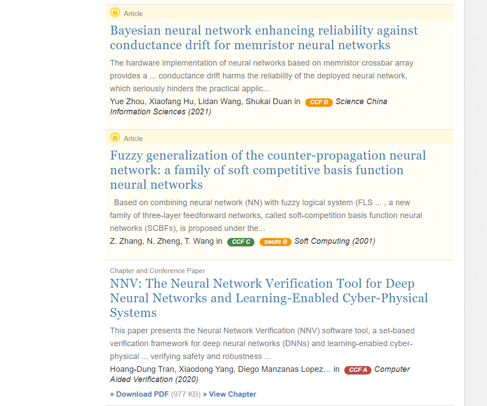
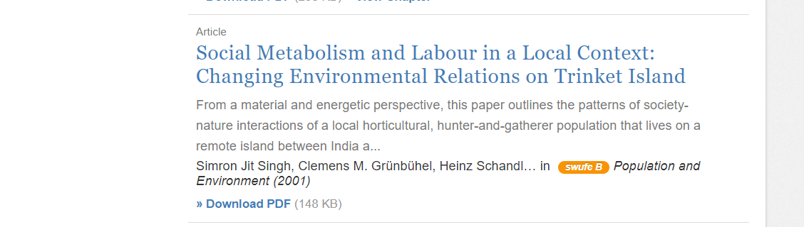
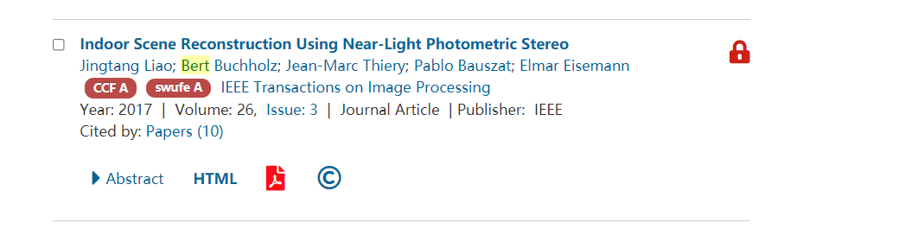
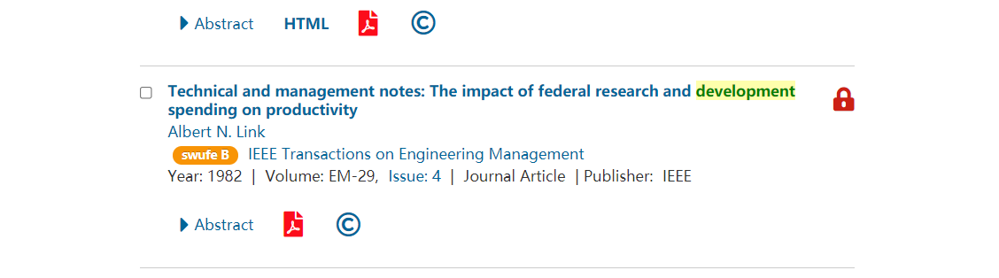
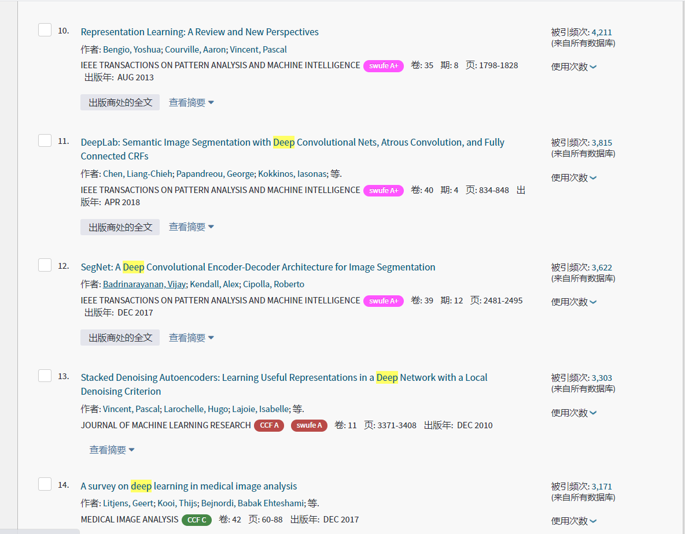
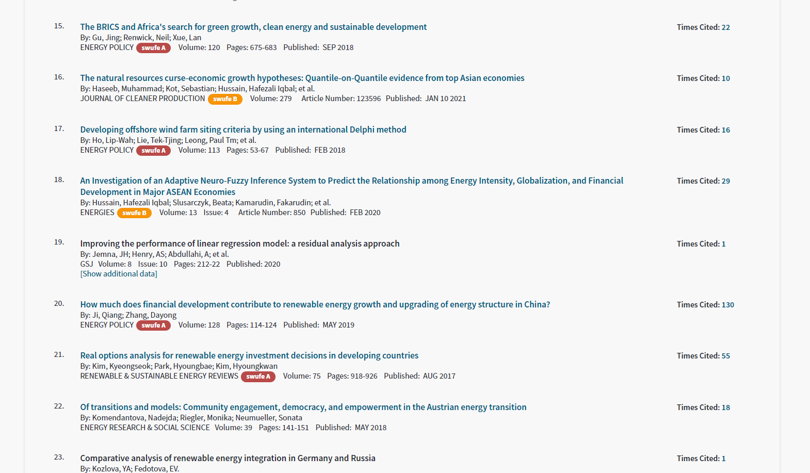
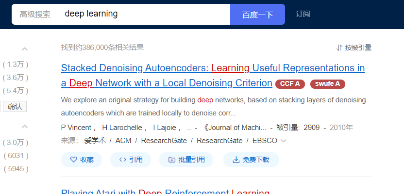
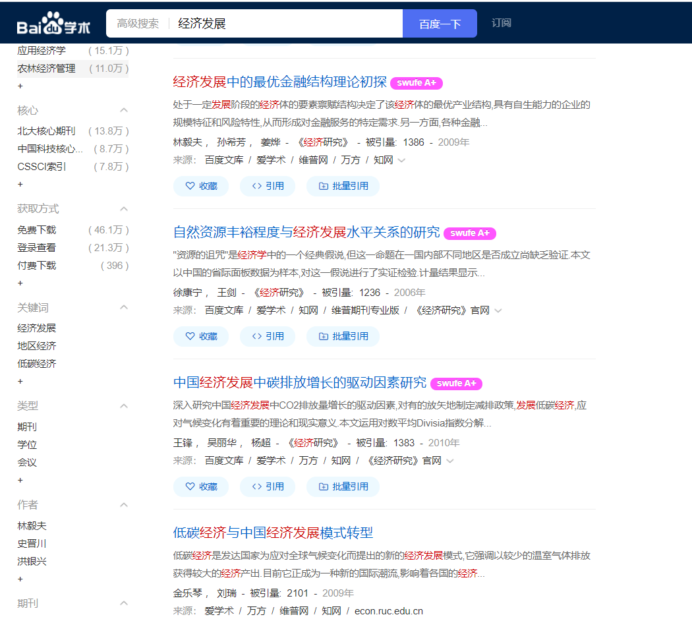

## 欢迎访问[swufe-ccf_show_ranking](https://github.com/Nixiak-nan/swufe-ccf_show_ranking)源代码资源库！
### Welcome to visit source of swufe-ccf_show_ranking!

### 简介

> swufe-ccf_show_ranking是踩在了巨人的肩膀上，我们利用了Github上开源的CCF插件二次制作而成，在此非常感谢作者的无私奉献。如果您需要该版本，请转到以下位置进行浏览和下载：[show-rank](https://github.com/hnshhslsh/show-rank), [CCFrank4dblp](https://github.com/WenyanLiu/CCFrank4dblp)

**swufe-ccf_show_ranking** 是一个[Google Chrome扩展](https://chrome.google.com/webstore/detail/swufe-cff-show-conference/njgedjcccpcfmjecccaajkjiphpddfji)，用于在论文搜索结果页面显示会议/期刊等级。

- 支持在[知网](https://www.cnki.net/)（中文）、[谷歌学术](https://scholar.google.com.hk/?hl=zh-CN)、[微软学术](https://academic.microsoft.com)、[Springer](https://link.springer.com/)、[IEEExplore](https://ieeexplore.ieee.org/) 、[web of science(新、旧版)](http://apps.webofknowledge.com/)、[百度学术](https://xueshu.baidu.com/)上显示[SWUFE](https://www.swufe.edu.cn/)（西南财经大学）等级

- 支持在[谷歌学术](https://scholar.google.com.hk/?hl=zh-CN)、 [Springer](https://link.springer.com/)、 [DBLP](https://dblp.uni-trier.de/)、 [IEEExplore](https://ieeexplore.ieee.org/) 和 [ACM Digital Library](https://dl.acm.org/) 上显示 CCF （中国计算机学会）等级

|       |     知网     | 微软学术 | 谷歌学术 | Springer | IEEExplore | ACM  | web of science |    百度学术    |
| :---: | :----------: | :------: | :------: | :------: | :--------: | :--: | :------------: | :------------: |
| SWUFE | 支持（中文） |   支持   |   支持   |   支持   |    支持    |      |      支持      | 支持（中、英） |
|  CCF  |              |   支持   |   支持   |   支持   |    支持    | 支持 |      支持      |      支持      |

### 安装

1. 谷歌应用商店下载 **（推荐）**：点击[SWUFE、CFF：显示会议/期刊等级](https://chrome.google.com/webstore/detail/swufe-cff-show-conference/njgedjcccpcfmjecccaajkjiphpddfji)，点击安装即可。
2. 火狐应用商店下载：点击[SWUFE、CFF：显示会议/期刊等级](https://addons.mozilla.org/zh-CN/firefox/addon/swufe_ccf_show_rank/?utm_source=addons.mozilla.org&utm_medium=referral&utm_content=search)，点击安装即可。
3. 离线安装方法（此为谷歌浏览器教程，其他浏览器步骤基本相似）：
   - 从[GitHub](https://github.com/Nixiak-nan/swufe-ccf_show_ranking)**下载**源代码
   - 解压至**某个文件夹**中。（可删除picture文件夹，两个pdf文件，readme.md）
   - 打开谷歌浏览器，依次点击**右上方三个小点点，更多工具，扩展程序**。
   - 打开右上方**开发者模式**。
   - 点击左上角**加载已解压的扩展程序**。
   - 选择**步骤2的文件夹**。

### 项目展示

- **在[知网](https://www.cnki.net/)上搜索论文时，会自动地在来源后加上会议/期刊的SWUFE等级，并以不同颜色标识，共分为A+,A,B,C四种。不仅支持原始知网链接，还支持使用[swufe-webvpn](https://webvpn.swufe.edu.cn/)登录知网的链接。**

- **在[谷歌学术](https://www.cnki.net/)上搜索英文论文时，会自动地在来源后加上会议/期刊的SWUFE、CCF等级，并以不同颜色标识，共分为A+,A,B,C四种.**

  

- **在[微软学术](https://academic.microsoft.com)会自动地在来源前加上会议/期刊的SWUFE、CCF，并以不同颜色标识。**

  

- **在 [Springer](https://link.springer.com/)会自动地在来源前加上会议/期刊的SWUFE、CCF等级，并以不同颜色标识。**

  

  ---

  

  

- **在[IEEExplore](https://ieeexplore.ieee.org/) 会自动地在来源前加上会议/期刊的SWUFE、CCF等级，并以不同颜色标识。**

  

  

- **在[web of science旧版](http://apps.webofknowledge.com/) 会自动地在来源前加上会议/期刊的SWUFE、CCF等级，并以不同颜色标识，支持以西财VPN访问的链接。**

  

  

- **在[web of science新版](https://www.webofscience.com/) 会自动地在来源前加上会议/期刊的SWUFE、CCF等级，并以不同颜色标识。（您可以点击右上角Products，点击web of science(Classic)切换回旧版），支持以西财VPN访问的链接。**

  

- **在[百度学术](https://xueshu.baidu.com/) 会自动地在来源前加上会议/期刊的SWUFE、CCF等级，并以不同颜色标识。**

  

- **在  [DBLP](https://dblp.uni-trier.de/), [IEEExplore](https://ieeexplore.ieee.org/) 会自动地在来源前加上会议/期刊的 CCF 等级，并以不同颜色标识。**

  在此不做演示，请前往[show-rank](https://github.com/hnshhslsh/show-rank)，[CCFrank4dblp](https://github.com/WenyanLiu/CCFrank4dblp)仓库查看

### 什么人需要这个插件？

- 若您是**西南财经大学**的学生，恭喜您，您非常适合这款插件。
- 若您是**其他财经高校**的学生，西财作为四大财经高校之一，它的排名有一定的参考价值，推荐您安装。
- 若您是**理工类高校**的学生，西财作为211高校，且《西南财经大学学术期刊目录2018》不仅是财经排名，还包括其他专业的期刊数据，推荐您安装体验，满意后自定义自己学校的数据。

### 想要自定义自己学校的数据？

- 点个**小星星 + fork**
- 修改data下的**swufeRankingName.js**中的数据
- 利用编辑器功能，进行**所有文件全局替换**，将**swufe**替换为自己学校的名称缩写
- 更换logo下的图片，请注意像素大小应该相同
- **若需要帮助替换数据，可以在Issues留言**

### 注意事项

- **此插件不会收集用户任何信息**
- **插件加载成功后，浏览指定网站时会自动运行，无需手动操作**
- **本插件提供的等级排名仅供参考，具体的排名信息，请以标准文件为准。**
- **若无法使用，请更新谷歌、Edge浏览器至最新版本**

### 数据来源

- CCF:  [magichan](https://github.com/magichan/CCF-Recommended-Catalog-2019) for CCF Rank data / 提供CCF排名数据，大约620种
- SWUFE :《西南财经大学学术期刊目录2018》，中文约600种，英文约1700种（已经去重）

### 更新日志

|   时间    |                          内容                           |                            贡献者                            |
| :-------: | :-----------------------------------------------------: | :----------------------------------------------------------: |
| 2021.6.6  |                    支持知网查询swufe                    |                          Nixiak-nan                          |
| 2021.6.19 |                  支持谷歌学术查询swufe                  | [museremarkable](https://github.com/Nixiak-nan/swufe_ccf_show_ranking/commits?author=museremarkable) |
| 2021.6.20 |                 将CCF-none修改为不显示                  | [museremarkable](https://github.com/Nixiak-nan/swufe_ccf_show_ranking/commits?author=museremarkable) |
| 2021.6.21 |          支持微软学术、IEEE、springer显示swufe          |                          Nixiak-nan                          |
| 2021.6.23 |                   成功在谷歌商店上架                    |                          Nixiak-nan                          |
| 2021.6.30 |            增加对web of science显示swufe等级            |                          Nixiak-nan                          |
| 2021.6.30 |                   成功在火狐商店上架                    |                          Nixiak-nan                          |
| 2021.7.1  |          增加对百度学术显示swufe等级（中、英）          |                          Nixiak-nan                          |
| 2021.7.10 |    增加对**新版**web of science显示swufe等级（V2.5）    |                          Nixiak-nan                          |
| 2021.8.2  |               修改了谷歌学术显示CCF的方式               |                          Nixiak-nan                          |
| 2021.8.3  | 增加了百度学术、web of science、微软学术显示CCF（V2.6） |                          Nixiak-nan                          |

